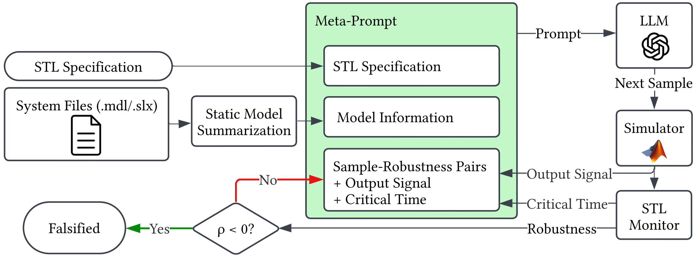

# LLM-Falsifier

[](https://arxiv.org/abs/2609.20752)
[](https://aliabigdeli.github.io/llm-falsifier/)
[](https://www.python.org/downloads/release/python-390/)
[](https://opensource.org/licenses/MIT)

Official implementation of **["Large Language Models as Falsifiers for Cyber-Physical Systems"](https://arxiv.org/abs/2609.20752)**
by [Ali ArjomandBigdeli](mailto:aarjomandbig@cs.stonybrook.edu), Jiawei Zhou, and Stanley Bak (Stony Brook University).

📄 **Paper:** [arXiv:2609.20752](https://arxiv.org/abs/2609.20752) &nbsp;|&nbsp;
🌐 **Project page:** [aliabigdeli.github.io/llm-falsifier](https://aliabigdeli.github.io/llm-falsifier/) &nbsp;|&nbsp;
💻 **Code:** [github.com/aliabigdeli/llm-falsifier](https://github.com/aliabigdeli/llm-falsifier)



## Overview

Falsification searches for counterexamples to formal specifications in cyber-physical systems (CPS). With
specifications written in Signal Temporal Logic (STL), falsification can be formulated as a robustness
optimization problem, traditionally tackled with black-box search algorithms. **LLM-Falsifier** is, to our
knowledge, the first LLM-driven robustness-guided falsifier for CPS: it falsifies specifications by prompting
a large language model to iteratively propose inputs that minimize the STL robustness degree.

Beyond generic prompt-based optimization, the key idea is to expose the LLM to *semantic* information that is
natural for language models but absent from standard numerical optimizers — natural-language input and output
names, output trajectories, and critical-time witnesses for the minimum robustness value. On the ARCH-COMP
falsification benchmarks, LLM-Falsifier outperforms existing falsification tools spanning surrogate-based
optimization, Bayesian optimization, and search-based testing on **14 of 21 specifications** when measured by
the average number of simulations needed to find a counterexample. On six specifications it finds a falsifying
input on the very *first* simulation in every run.

This repository contains the implementation, built on top of the
[$\Psi$-TaLiRo](https://github.com/cpslab-asu/psy-taliro) framework. The core logic, including the LLM-based
optimizers, is located in `src/llm_falsifier`, while experimental benchmarks are provided in the `archcomp/`
directory.

## Prerequisites

- **Python**: Version 3.9
- **Package Manager**: [uv](https://docs.astral.sh/uv/)
- **MATLAB**: Version 2022a with Simulink installed (required for `matlabengine==9.12.21`)

## Installation

1.  **Install `uv`** (if not already installed):
    ```bash
    # On macOS/Linux
    curl -LsSf https://astral.sh/uv/install.sh | sh
    
    # On Windows
    powershell -c "irm https://astral.sh/uv/install.ps1 | iex"
    ```

2.  **Sync Dependencies**:
    Initialize the environment and install dependencies locked in `uv.lock`.
    ```bash
    uv sync
    ```

3.  **Setup API Key**:
    Create a file named `api_key.txt` in the root directory of the project and paste your OpenAI API key into it.
    ```bash
    echo "sk-your-openai-api-key-here" > api_key.txt
    ```
    Alternatively, you can use local LLMs such as `gpt-oss-20b` by setting up an LM-Studio local server, without needing an OpenAI API key.

## Usage

Experiments are located in the `archcomp/` directory.

### Running Falsification Experiments

To run an experiment, navigate to the `archcomp` directory and use `uv run` to execute the experiment script.

```bash
cd archcomp
uv run autotrans_all_specs.py \
    --spec AT1 \
    --optimizer LLMGB \
    --seed 1 \
    --reasoning-effort low \
    --llm-model gpt-5-nano \
    --max-budget 100 \
    --output-time-selection 6 \
    --include-critical-time
```

See [`archcomp/README.md`](archcomp/README.md) for the full list of benchmarks, specifications, and command-line
options.

## Project Structure

- **`src/llm_falsifier/`**: Source code for the package.
  - `optimizers.py`: Implementation of `LLMOptimizer`(LLM) and `LLMGrayBoxOpt`(LLMGB) optimizers.
  - `base_runner.py`: Base class for running specifications.
  - `optimizer_factory.py`: Factory for creating optimizer instances.
- **`archcomp/`**: Benchmarks and experiment scripts (e.g., Automatic Transmission, F16, etc.).
- **`docs/`**: Source of the [project webpage](https://aliabigdeli.github.io/llm-falsifier/) (GitHub Pages).
- **`pyproject.toml` & `uv.lock`**: Project dependency definitions.

## Troubleshooting

- **MATLAB Engine Error**: Ensure you have MATLAB R2022a installed. The `matlabengine` version pinned in this project (`9.12.21`) corresponds specifically to R2022a. If you have a different version, you may need to update the dependency in `pyproject.toml` and run `uv sync`, though compatibility is not guaranteed.
- **API Key Errors**: Ensure `api_key.txt` exists in the project root or the `OPENAI_API_KEY` environment variable is set correctly.

## Citation

If you find this work useful, please cite our paper:

```bibtex
@misc{arjomandbigdeli2026llmfalsifier,
  title         = {Large Language Models as Falsifiers for Cyber-Physical Systems},
  author        = {ArjomandBigdeli, Ali and Zhou, Jiawei and Bak, Stanley},
  year          = {2026},
  eprint        = {2609.20752},
  archivePrefix = {arXiv},
  primaryClass  = {eess.SY},
  url           = {https://arxiv.org/abs/2609.20752}
}
```

## License

This project is released under the MIT License.

The Simulink models in `archcomp/` (`Autotrans_shift.mdl`, `cars.mdl`, `narmamaglev_v1.slx`,
`steamcondense_RNN_22.slx`) are redistributed from the ARCH-COMP falsification benchmarks and remain subject to
their original terms.
